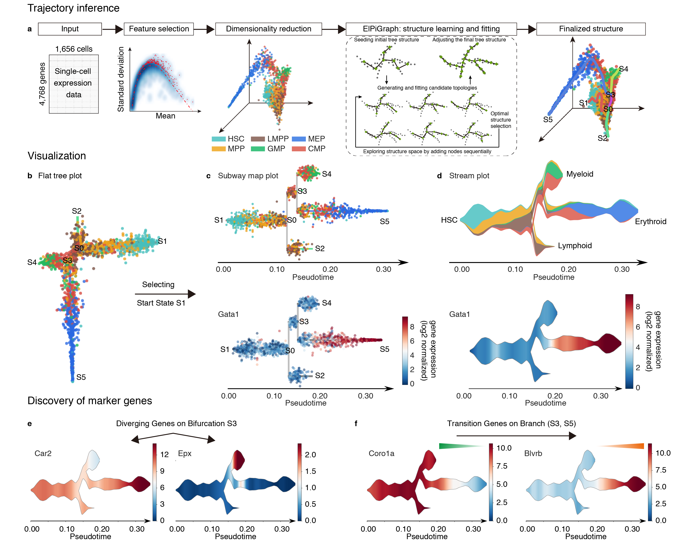

[STREAM](https://bioconda.github.io/recipes/stream/README.html) is an interactive computational pipeline for reconstructing complex cellular developmental trajectories from sc-qPCR, scRNA-seq or scATAC-seq data.

# Use

`docker pull pinellolab/stream:0.3.2`

### Test data

`curl -L -o testData.zip https://www.dropbox.com/sh/n8qq4m7w17i6b07/AAAro_qY_-q5VBDC1sZg-LE5a?dl=0?dl=1`

Input files must be located in the directory where the docker container will be launched

### Trajectory inference with marker gene exploration (transcriptomic data)

`docker run  -v ${PWD}:/data -w /data  pinellolab/stream -m `[ data_Nestorowa.tsv.gz ](https://www.dropbox.com/sh/n8qq4m7w17i6b07/AAB9GyV9LjVoxZfOiT-h5B2Qa/Nestorowa_2016/data_Nestorowa.tsv.gz?dl=1)` -l `[ cell_label.tsv.gz ](https://www.dropbox.com/sh/n8qq4m7w17i6b07/AAD38lqq1vKvPOXN5AgkMBfYa/Nestorowa_2016/cell_label.tsv.gz?dl=1)` -c `[ cell_label_color.tsv.gz ](https://www.dropbox.com/sh/n8qq4m7w17i6b07/AABKYz6iITR0MHGoSLKTYxVta/Nestorowa_2016?dl=0&preview=cell_label_color.tsv.gz?dl=1)` --DE --TG --LG `

### Feature mapping

`docker run  -v ${PWD}:/data -w /data  pinellolab/stream -m `[ data_Olsson.tsv.gz ](https://www.dropbox.com/sh/n8qq4m7w17i6b07/AAAnq2J4jQFGi-fari9MdTvla/Olsson_2016/data_Olsson.tsv.gz?dl=1)` -l `[ cell_label.tsv.gz ](https://www.dropbox.com/sh/n8qq4m7w17i6b07/AADijJwgDGhzV_9ysH0sI31Ya/Olsson_2016/cell_label.tsv.gz?dl=1)` -c `[ cell_label_color.tsv.gz ](https://www.dropbox.com/sh/n8qq4m7w17i6b07/AAA8-eOtgzplTQvRP4vfs7iFa/Olsson_2016/cell_label_color.tsv.gz?dl=1)` --lle_components 4 --EPG_shift`

 `docker run  -v ${PWD}:/data -w /data  pinellolab/stream --new`[ data_perturbation.tsv.gz ](https://www.dropbox.com/sh/n8qq4m7w17i6b07/AAAEZCnFl-EoAyGutCuzuyLGa/Olsson_2016/data_perturbation.tsv.gz?dl=1)`--new_l `[ cell_perturbation_label.tsv.gz ](https://www.dropbox.com/sh/n8qq4m7w17i6b07/AABb5KU4S7GLtZM8NhVRErsqa/Olsson_2016/cell_perturbation_label_color.tsv.gz?dl=1)` --new_c `[ cell_perturbation_label_color.tsv.gz ](https://www.dropbox.com/sh/n8qq4m7w17i6b07/AACVyTQDrmQHtuQhUqyG0ngCa/Olsson_2016/cell_perturbation_label.tsv.gz?dl=1)

### Trajectory inference (scATAC-seq data) using precomputed z-score file

`docker run  -v ${PWD}:/data -w /data  pinellolab/stream --atac -m `[ zscore.tsv.gz ](https://www.dropbox.com/sh/n8qq4m7w17i6b07/AACkxwaEVVZ4IkxJG1ADxfZ2a/Buenrostro_2018/zscore.tsv.gz?dl=1) `--atac_samples`[ sample_file.tsv.gz ](https://www.dropbox.com/sh/n8qq4m7w17i6b07/AADEVxZGT1-0e5D31o_NIxv-a/Buenrostro_2018/sample_file.tsv.gz?dl=1) `--atac_regions `[ region_file.bed.gz ](https://www.dropbox.com/sh/n8qq4m7w17i6b07/AAAnNaOw6L1v7BsKmdy38cqUa/Buenrostro_2018/region_file.bed.gz?dl=1) `-l` [ cell_label.tsv.gz ](https://www.dropbox.com/sh/n8qq4m7w17i6b07/AACHsOfkrmOSF59RyjprdzD6a/Buenrostro_2018/cell_label.tsv.gz?dl=1) `-c`[ cell_label_color.tsv.gz ](https://www.dropbox.com/sh/n8qq4m7w17i6b07/AABny8uO3UknufsUtlOKQsyma/Buenrostro_2018/cell_label_color.tsv.gz?dl=1) `--lle_components 4`

# Validate 
Run the following code to confirm that the docker container implemented in your environment generates output that matches reference output provided for this method:

`docker run --entrypoint stream_run_test pinellolab/stream`

This validation test includes marker gene detction and will take ~15m to finish.

# Integrate
View STREAM in its [production portal](http://stream.pinellolab.org/).

# Contact
Huidong Chen (<a href="mailto://huidong.chen@mgh.harvard.edu">huidong.chen@mgh.harvard.edu</a>), Luca Pinello (<a href="mailto://lpinello@mgh.harvard.edu">lpinello@mgh.harvard.edu</a>)