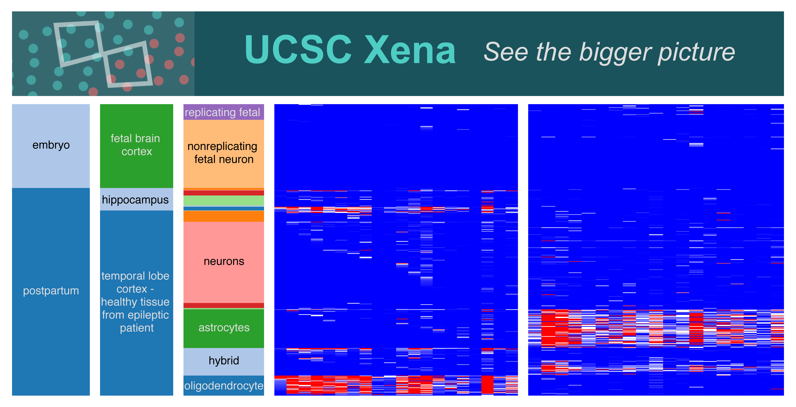

[UCSC Xena single cell browser] (https://singlecell.xenahubs.net) is an online exploration tool for single cell RNA-seq data and associated meta-data and annotations. Xena downloads the latest HCA gene expression datasets available at [HCA Data Portal](https://prod.data.humancellatlas.org/). Researchers can query and visualize expressions of any genes of their interest on Xena. The primary visualization is Xena's Visual Spreadsheet. Analogous to an office spreadsheet, it is a visual representation of a data grid where each column is a slice of genomic data (e.g. a gene or a set of genes' expression, inferred cell type, cell location), and each row is a single cell.  Researchers interactively query the HCA data and build their spreadsheet, enabling the discovery of patterns and correlations in gene expression, across multiple genes and cell annotations. Researchers can also dynamically create cell groups based on any genomic data already on the spreadsheet, filer and compare cell groups using Xena Charts and statitical analysis. Live visualizations can be saved as Xena Bookmarks, to access the same view again later or be shared with colleagues.

# Contact
<a href="mailto:ucsc-cancer-genomics-browser@googlegroups.com">ucsc-cancer-genomics-browser@googlegroups.com</a> 
<a href="mailto:genome-cancer@soe.ucsc.edu">genome-cancer@soe.ucsc.edu</a>

<a href="https://twitter.com/UCSCXena">Follow @UCSCXena</a>
