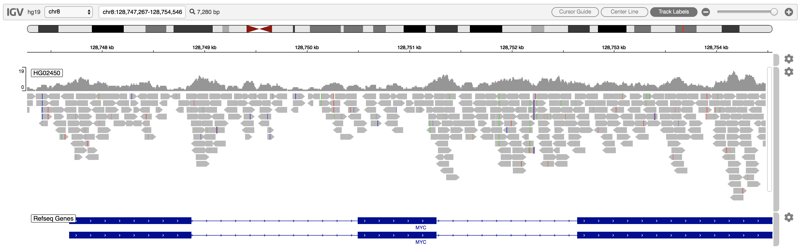

igv.js is an embeddable interactive genome visualization component based on the desktop Integrative Genomics Viewer (IGV).

# Install
`npm install igv`

# Contact
IGV team (<a href="mailto://igv-team@broadinstitute.org">igv-team@broadinstitute.org</a>)
