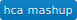

Versatile matrix visualization and analysis software. View your dataset as a heat map, then explore the interactive tools in Morpheus. Cluster, create new annotations, search, filter, sort, display charts, and more.
