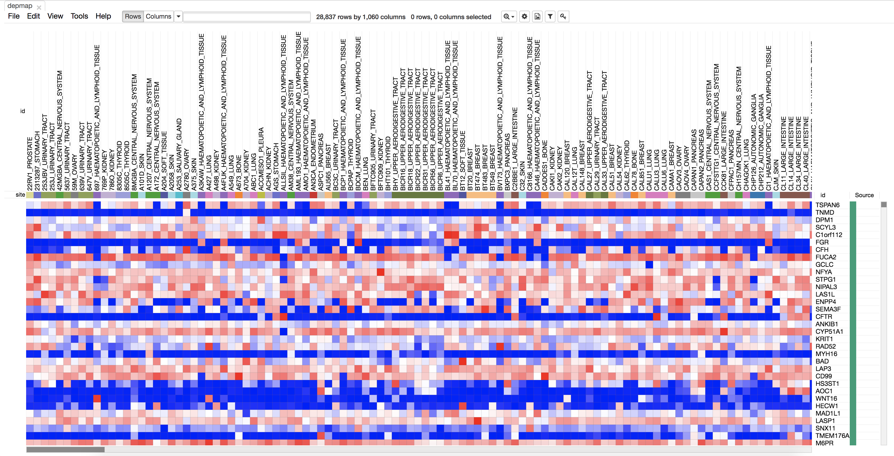

Morpheus is versatile matrix visualization and analysis software. View your dataset as a heat map, then explore the interactive tools in Morpheus. Cluster, create new annotations, search, filter, sort, display charts, and more.

# Install
`npm install morpheus-app`

# Contact
Joshua Gould (<a href="mailto://morpheus@broadinstitute.org">morpheus@broadinstitute.org</a>)
