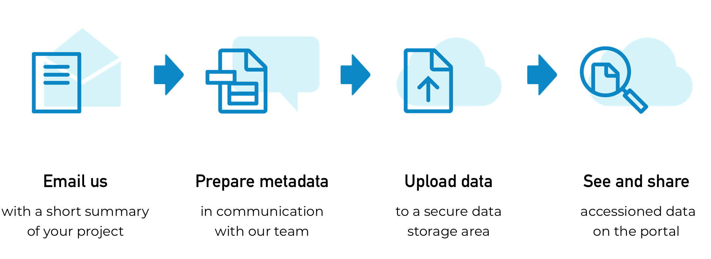

# Help build the Human Cell Atlas - submit data

The Human Cell Atlas is built with the help of and for the benefit of the scientific community. Our team welcomes contributions of raw data at cellular resolution, as long as it is consented for open access to the public.

## Data Suitability

At the moment, the HCA considers five criteria to assess the suitability of a dataset for building the Atlas.

Each of the five criteria have the following statuses:

- **Green**: We are happy to receive your dataset.
- **Amber**: We are happy to discuss the value of your dataset to the HCA.
- **Red**: We are not collecting these data at the moment, but we would like to learn more about it.

Learn more about the data suitability criteria [here](/contribute/data/contributing-data-suitability.md).

## Data Submission Process

Once you are ready to submit your data, you will be supported by the Human Cell Atlas data wranglers. We currently use spreadsheets to collect metadata and a command-line tool to transfer the data files to our cloud infrastructure. 

In order to process your cellular resolution data, we will request the following information:

- Unprocessed data files
- Information on samples
- Information on experiment and protocols
- Summary of project and team information
- Confirmation that data is consented for open access

Learn more about what to expect and how to prepare for the data submission process [here](/contribute/data/tbd.md).

> Ready to contribute? Start the conversation by emailing [data-help@humancellatlas.org](mailto:data-help@humancellatlas.org).

## Data Processing and Results

Once submitted to the Human Cell Atlas, the data will be: 
 
- Searchable in the [HCA Data Browser](/explore/projects).
- Processed by the [Data processing pipelines](/pipelines) to produce alignment results that will be available in the Data Browser.
- Available through the Matrix Service to produce quantification results.
- Accessioned in standard archives.

Learn more about what results will be available for different data types [here](/contribute/data/tbd.md).

1. **Analysis Results**

    For Smart-seq2 and 10X v2 single-cell RNA-seq experiments, data will be processed by our standard [processing pipelines](/pipelines). Alignment and quantification results will be made available in the Data Browser alongside raw data.

    Your data will also be available for use directly in [analysis applications](/analyze/methods) available through the Data Portal.

1. **Repository Accessions**

    To support publishing your research, we will submit raw data to community standard archives and return the archival accessions that you need for publication.

    Currently we are able to archive projects, samples, and sequencing data in BioStudies, BioSamples, and the European Nucleotide Archives (ENA), respectively. We are working towards supporting submission to the NCBI Gene Expression Omnibus (GEO) if your funding mandates submission there. Please let a data wrangler know if this is the case when you start your submission process.

    At the moment we will not automatically archive imaging data. We are engaged with the community to understand what the archival best practices are for biological images, and we will work to support submission to these archives in the future.

> #### Start the Process
> Start the HCA submission process by emailing\
> [data-help@humancellatlas.org](mailto:data-help@humancellatlas.org).
