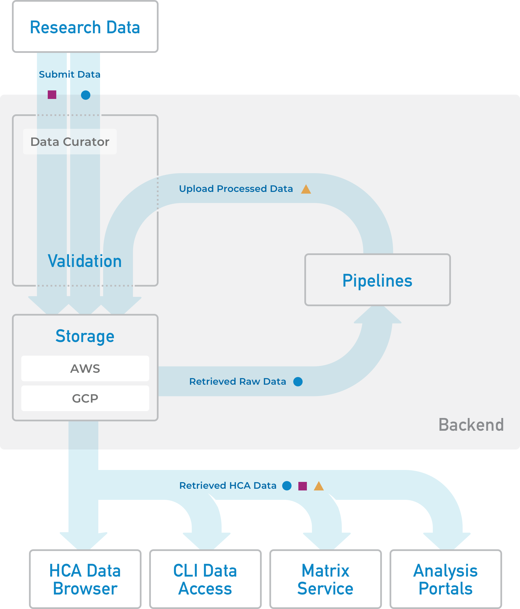

# Data Lifecycle

## Introduction

The Human Cell Atlas (HCA) Data Coordination Platform (DCP) is built to ingest, organize, process, and provide terabytes of cellular resolution data generated by researchers around the world using multiple types of data generation protocols.

Here we describe the general process of data flow through the components of the DCP. Please see the guides in the *Guides* section for more detailed information.

## Ingestion Service

Data flow begins with the ingestion of raw experimental data files and associated metadata. Currently, the ingest process is supported by HCA data wranglers, an interactive UI, and a REST API. The Ingestion Service processes, validates, and assembles biomolecular data and metadata before pushing them to the central Data Store, where all HCA data are stored. 

### Upload and Processing

Data contributors provide metadata for a dataset as structured spreadsheets. Metadata spreadsheets are processed into a standard format and then validated to enable interoperability between all datasets in the HCA.

Data are provided in standard file formats, such as FASTQ format for sequencing data. Data contributors transfer data files to a cloud storage system through the Upload Service. These files are temporarily stored prior to being validated and are then transferred to the Data Store.

### Validation

After metadata are processed, they are validated to check if they conform to the HCA [metadata standards](/metadata/structure). At this stage, the Ingestion Service identifies errors in the metadata and allows corrected metadata to be uploaded. Data files are checked for errors to ensure they are well-formatted and conform to the corresponding file format standards.

### Submission

When all data files and metadata for a dataset are processed and valid, they are then submitted to the Data Store.

## Data Store

The Data Store is a cloud-native space for storage that leverages multiple cloud platforms. Currently, all data in the Data Store is stored in Amazon Web Services (AWS) and synchronized with Google Cloud Platform (GCP), ensuring that the data is accessible in each environment. Once data is stored in the Data Store it is available to anyone. The goals of the Data Store include:

* ensure simple and direct data access for downstream consumers
* notify users of repository changes
* synchronize data across multiple cloud providers.

## Data Processing Pipelines Service

In the HCA DCP, data processing refers to the use of a computational pipeline to analyze raw experimental data from a specific assay. Processing of HCA data produces collections of quality metrics and features that can be used for further analysis. For example, for data generated using the Smart-seq2 methodology, data processing pipeline outputs include gene alignment, transcript quantification, and quality control assessments.

When raw data moves into the Data Store a notification is triggered and sent to the Data Processing Pipeline Service, indicating data is available for processing. If a processing pipeline specific for that data type exists, the service activates a series of three sub workflows to 1) obtain the data file(s) from the Data Store, 2) run the data through the appropriate pipeline, producing new files of analysis results, and 3) submit the new results back to the Ingest Service to be stored in the Data Store.

See the *Pipelines* Section for [detailed information](/pipelines) about the DCP Data Processing Pipelines; [guides for developing pipelines](/pipelines/pipeline-development/processing-pipelines/pipeline-processing-development-guides) are also in *Pipelines*.

## Data Access by End Users
Access to the Data Store is supported with REST API (and associated CLI) using the Data Store's Consumer API. In addition, we have developed a Data Browser, accessible from the *Explore* section, that enables extensive browsing of the data through this Data Portal. Data will also be accessible through tools and portals developed by the community.

