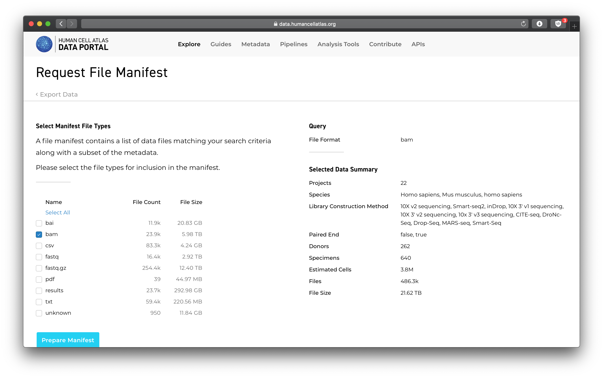
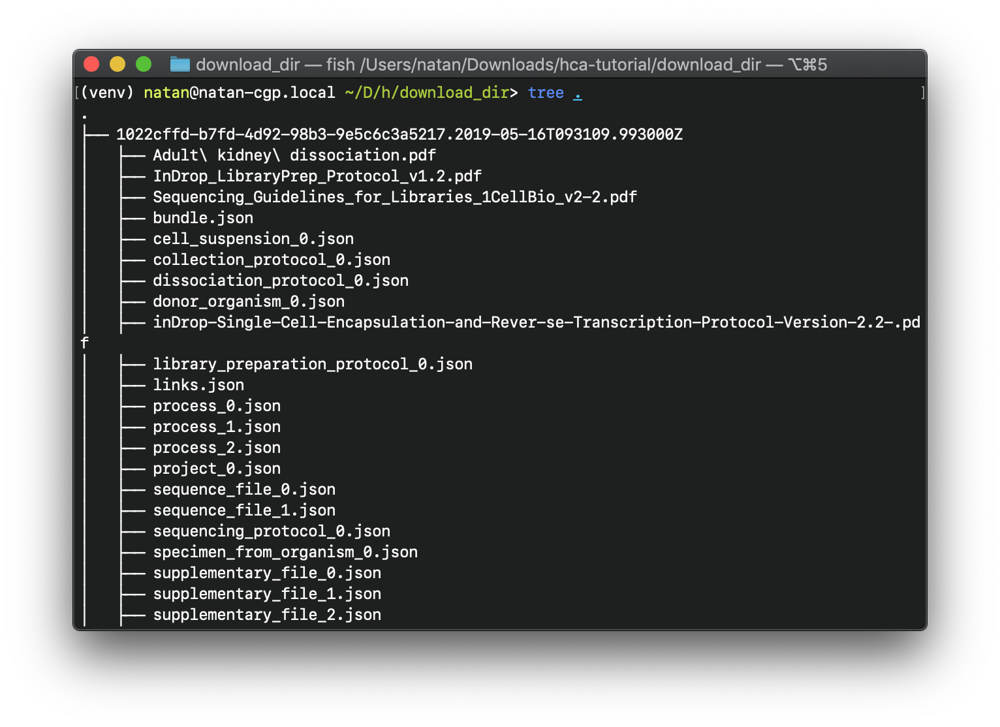
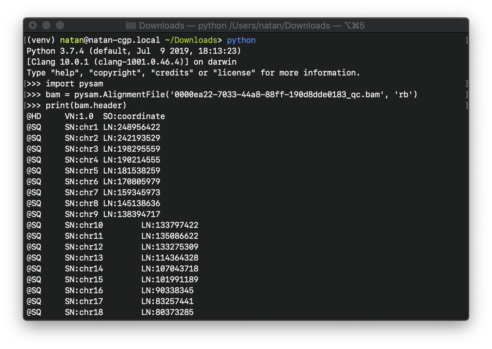

# Introduction to Downloading and Analyzing HCA Data

In this tutorial, you'll learn how to find BAM files using the HCA Data
Explorer, how to download those files to your computer using the HCA CLI
tools, and how to perform basic analysis on that data.

We'll assume that you have some familiarity with the tools aforementioned.
In particular, you'll want to be acquainted with the content in these
tutorials:

- [Installing the HCA Command Line Interface][installing-the-hca-cli]
- [Accessing HCA Data and Metadata][quick-start-guide]

## Step one: finding BAM files with the HCA Data Explorer

You can use the [HCA Data Explorer][exporer] to find data to download using
the HCA CLI tools. The Data Explorer lists projects with data available
for download from the Data Store and lets you filter the data for a number of
attributes.

If you were interested in a project, you could select the project(s) you were
interested in then click the big blue *Export Selected Data* button at the top
right of the page. You would see something like this:

You would then be able to a subset of data to download from that project:

From your selection, the Data Explorer would produce a *file manifest* - a
file that can be read by the HCA CLI tools that tells it what files to download
and where to find them. Keep this manifest - we'll use it in the next step.

(If you don't want to wait around to download a huge data set, you can download
an individual .bam file directly from the *Files* tab. Such a download doesn't
produce a file manifest, so if you take this route, you can skip Step 2.)

## Step two: downloading files from a file manifest with the HCA CLI

Once you've downloaded the file manifest, downloading your data is easy using
the `hca dss download-manifest` command. With the manifest, you could do
something like

    hca dss download-manifest --manifest <path-to-manifest-file> \
        --download-dir <download-data-here> --replica 'aws' \
        --layout bundle

where the `replica` is the cloud platform to download your data from (either
`aws` or `gcp`). The `--layout bundle` option tells the `hca` command to
organize the downloaded files by the bundle they're associated with in
the download directory.

You might need to log in to the DSS. This [Data Consumer Vignette][login]
shows how you can do that.

For a full enumeration of all the options you can pass to `download-manifest`,
do

    hca dss download-manifest -h

.

Depending on how much data was selected, the download might take a second. Once
the download is complete, you'll see the data you downloaded arranged by
bundle:

For Step 3, choose any of the downloaded .bam files.

## Step three: analyzing downloaded files locally

With the data you selected now downloaded locally, we can operate on it like
any other file. Let's try opening a downloaded .bam with pysam with this Python
code:

    import pysam
    bam = pysam.AlignmentFile(path_to_bam, "rb")
    print(bam.header)

For more information on pysam, check out its [documentation][pysam].

## Additional documentation

If you'd like to learn more, you might find the Jupyter notebooks in the
[Data Consumer Vignette][dcv] repository useful. This tutorial was loosely
based on the [Download Any BAM file][download-bam] vignette.

There are many different ways to launch Jupyter Notebooks including:

* Running [Jupyter Notebook](https://jupyter.org/) or [JupyterLab][JupyterLab]
  locally on your own system
* Running on the cloud for free via [Binder](https://mybinder.org/)
* Running on the cloud via [Terra](https://terra.bio/)

  [login]: https://github.com/HumanCellAtlas/data-consumer-vignettes/blob/master/Login%20to%20the%20DSS/Log%20In.ipynb
  [explorer]: https://data.humancellatlas.org/explore/projects
  [dcv]: https://github.com/HumanCellAtlas/data-consumer-vignettes
  [download-bam]: https://github.com/HumanCellAtlas/data-consumer-vignettes/tree/master/Download%20Any%20BAM%20File
  [pysam]: https://pysam.readthedocs.io/en/latest/api.html
  [JupyterLab]: https://blog.jupyter.org/jupyterlab-is-ready-for-users-5a6f039b8906
