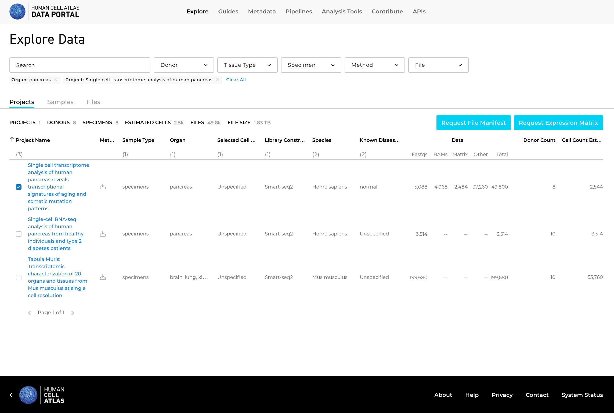

## Japan Science Meeting Tutorial

This tutorial will walk you through the process of finding data in the HCA Data
Explorer, generating a data matrix in loom format, and then loading these data
into scanpy and briefly exploring.

This work leverages data from the study [Single-Cell Analysis of Human Pancreas Reveals Transcriptional Signatures of Aging and Somatic Mutation Patterns by Enge, et al.](https://www.ncbi.nlm.nih.gov/pmc/articles/PMC6047899/).

### Step - Performing a Search in the Data Explorer

### Step - Downloading the Expression Matrix

### Step - Launching the Notebook

### Step - Examining the Result
