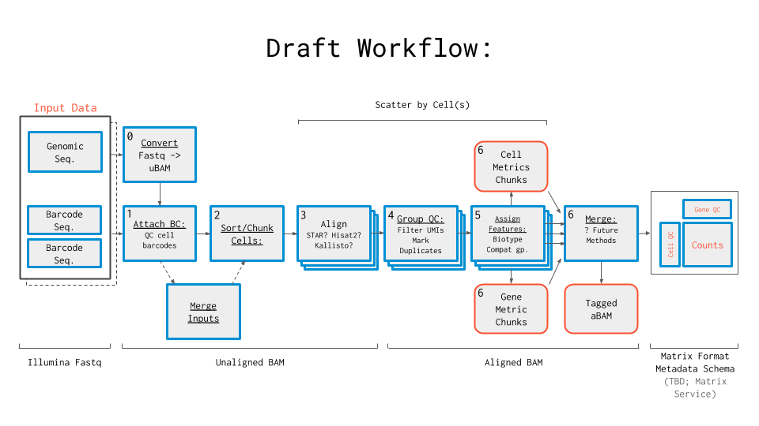

## Description of 3-prime scRNA sequencing

## Overview of our Pipeline-building Strategy

We are building pipeline technologies to support RNA sequencing of cells isolated using Drop-seq. This particular pipeline is designed to identify and quantify reads generated by 3’ scRNA-seq, and augment the input data with metadata derived during the processing steps. Rather than remove reads determined by the pipeline to be of lesser quality, all reads are kept with their associated metadata and incorporated into the output files. Thus, for example, reads that do not align with genes are not removed. This design, which differs from most pipelines currently available, enables use of the entire dataset by those who may be less interested in specific biological questions and more interested in computational aspects of the data.

## Quick Start Table

| Pipeline Features | Description | Source |
|-------------------|---------------------------------------------------------------|-----------------------|
| Overall Workflow  |Quality control module and transcriptome quantification module | Code available from [Github](https://github.com/HumanCellAtlas/skylab/blob/master/pipelines/optimus/Optimus.wdl) |
| Workflow Language |WDL          |[openWDL](https://github.com/openwdl/wdl)|
| Genomic Reference Sequence|GRCh38 human genome primary sequence|Link (external) Link (blue box)|
|Transcriptomic Reference Sequence |V27 GenCode human transcriptome |Link (external) Link (blue box)|
| Aligner           |STAR       |[Dobin, et al.,2013](https://www.ncbi.nlm.nih.gov/pmc/articles/PMC3530905/)|
| Transcript Quantification |        |                                              |                       |
|Data Input File Format | FASTQ      |                                              |                       |
|Run Time               |            |                                              |                       |

## Pipeline Overview

This workflow processes 3’ sequencing data generated from the 10X Genomics v2 assay. It corrects cell barcodes and Unique Molecular Identifiers (UMIs), aligns reads, marks duplicates, and returns data as alignments in BAM file format and as counts in sparse matrix exchange format. The pipeline is described below and [the code](https://github.com/HumanCellAtlas/skylab/blob/master/pipelines/optimus/Optimus.wdl) is available from Github.

## Workflow Summary

## Cell Barcode Correction

Although the function of the cell barcodes is to identify unique cells, several barcode errors, such as incorporation of the barcode into contaminating DNA or sequencing and PCR errors can arise, make it challenging to distinguish unique cells from artifactual appearances of the barcode. The first step of this pipeline is to correct for cell barcode errors.

Cell barcode correction uses as input files in BAM file format; thus the fastq files containing the raw sequence data from the sequencer must first be converted to BAM files. This is done using the FastqToUBam.wdl tool, described [here](https://software.broadinstitute.org/gatk/documentation/tooldocs/4.0.3.0/picard_sam_FastqToSam.php). The output BAM files contain sequence that is complementary to the mRNA transcript data in the fastq files and can thus be aligned to the genomic sequence in a later alignment step.

The [Attach10xBarcodes](https://github.com/HumanCellAtlas/sctools) tool is then used to attach 10X barcodes found in the fastq sample to the corresponding reads in the BAM file, producing a barcoded.bam file. The tool uses as input three files:1) the original fastq file of forward reads (r1), containing the unique molecular identifier and cell barcode sequences, 2) an index fastq file which contains the Illumina sample barcodes, and 3) the unmapped bam file of reverse reads (r2), which is the alignable genomic information. The reads in these files are in the same order, and the tool works sequentially through the data, putting the barcodes found for each read of the first 2 fastq files  onto the corresponding read of the third (BAM) file.  The program returns as output a barcoded.bam file containing the reads with correct barcodes (this includes barcodes that came within one error of matching, which are corrected by this tool). These are assigned a “CB” tag. Uncorrected barcodes are preserved and given a “CR” (Cell barcode Raw) tag. During this process, barcoded reads are sorted into cell groups so that the data is divided into reads per cell chunks.

The remainder of the pipeline processes these chunks in parallel.

TODO: make the rest of the docs have links like this?

WDL: [Attach10xBarcodes.wdl](https://github.com/HumanCellAtlas/skylab/blob/master/library/tasks/Attach10xBarcodes.wdl)

Docker: [Python3-scientific](https://github.com/HumanCellAtlas/skylab/blob/master/docker/python3-scientific/Dockerfile)

Key Library: [Sctools](https://github.com/HumanCellAtlas/sctools)

## Alignment

The [STAR](https://www.ncbi.nlm.nih.gov/pmc/articles/PMC3530905/) alignment software is used to map the reads to the GRCh38 human genome primary assembly reference. STAR (Spliced Transcripts Alignment to a Reference) is widely-used for RNA-seq alignment and identifies the best matching location(s) on the reference for each sequencing read.

## Gene Annotation

The [TagGeneExon]() tool from [DropSeqTools] is used to annotate each read with the type of sequence it aligned to. These annotations include `INTERGENIC`, `INTRONIC`, and `EXONIC`, and are stored in the `XF` tag. In cases where the gene corresponds to an intron or exon, the name of the gene that overlaps the alignment is associated with the read and stored in the `GE` tag.

## Duplicate Marking

Optical and PCR duplicates are marked using [`UmiAwareMarkDuplicates`]() tool. This tool corrects groups reads based on their UMI, gene, and alignment position. Future improvements will make this tool group by cell barcode as well [See this picard issue](). In groups containing more than one sequencing read, one read is selected as primary, and the rest are marked as duplicates. This tool also corrects cell barcodes using an approach modified from [Jaitin et al.](), wherein reads are subsumed into larger groups when they share the same position and gene, and the UMI is within an edit distance of 1.

## Metrics

A number of quality control tools are used to assess the quality of the data output each time this pipeline is run. For a list of the tools and information about each one please see [this page] of our documentation.

## Count Matrix Construction

The pipeline outputs a count matrix that contains, for each cell and for each gene, the number of molecules that were observed. In practice, this equates to counting up the number of sequencing reads with 255 map quality (uniquely aligned to the genome) that are not duplicates (are the representative member of one or more alignments that share the same UMI, and therefore derive from the same molecule). The count matrix is then generated as a tab-separated
