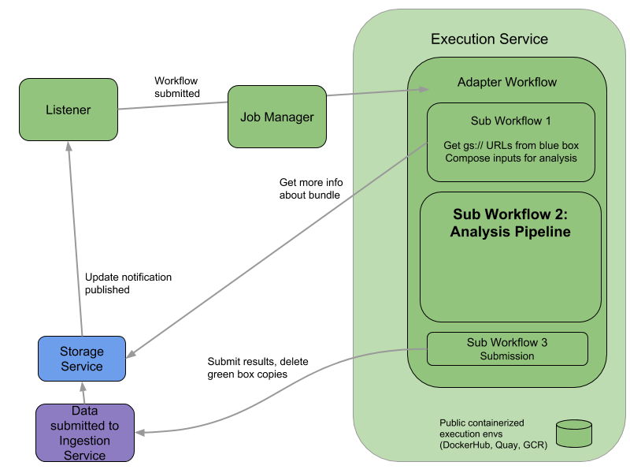

## Overview of Secondary Analysis

Raw data moves from Data Storage  to the Secondary Analysis Service to be processed through an analysis pipeline specific for that data type. For example, for data generated using Smart-seq2 or 3’ RNA-Seq methodology, secondary analyses include gene alignment, transcript quantification, and quality control assessments. The resulting data files are moved to the Data Storage Service for download by users.

The figure above describes data flow through the Secondary Analysis Service. Raw submitted data moves from the Ingestion Service to the Storage Service, triggering a notification that data is available for secondary analysis. The notification is received by the Secondary Analysis Service Listener, which determines the pipeline to use with the particular data type submitted based the information provided in the notification. The Execution Service then applies Sub Workflow 1 to obtain the data file(s) from the original data bundle. The data in these files are analyzed using the appropriate pipeline (Sub Workflow 2), producing new files of analysis results which are submitted (Sub Workflow 3) back to the Ingestion Service as a secondary bundle, for validation and subsequent storage. The secondary bundle is engineered so that it doesn’t trigger the sending of a notification to the Listener, ensuring that the analysis results are the final step of processing for that original set of raw data.
