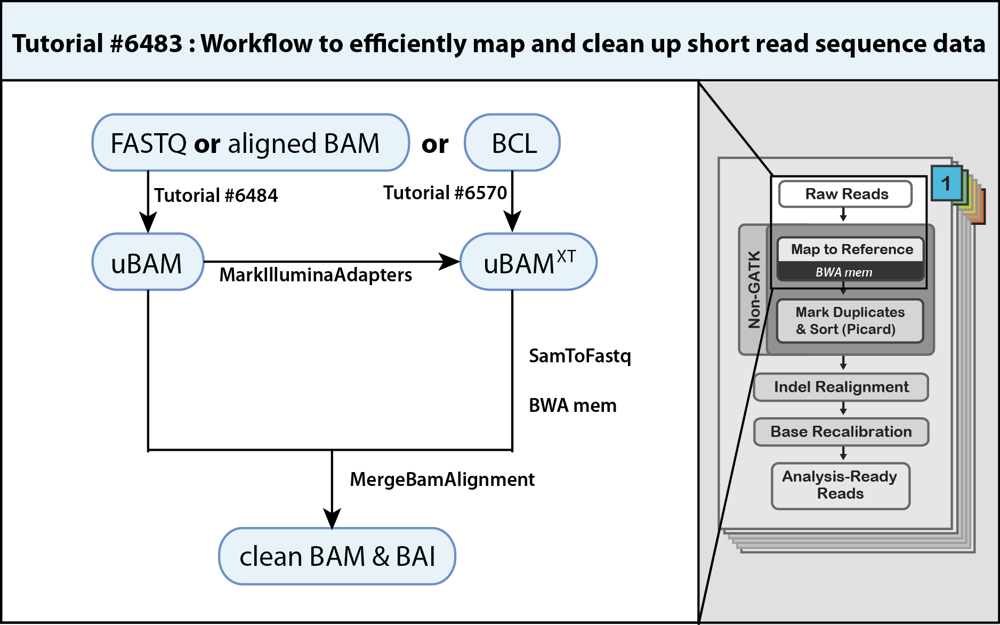

## Overview of Secondary Analysis

Raw data moves from Data Storage  to the Secondary Analysis Service to be processed through an analysis pipeline specific for that data type. For example, for data generated using Smart-seq2 or 3’ RNA-Seq methodology, secondary analyses include gene alignment, transcript quantification, and quality control assessments. The resulting data files are moved to the Data Storage Service for download by users.

Figure Legend:
