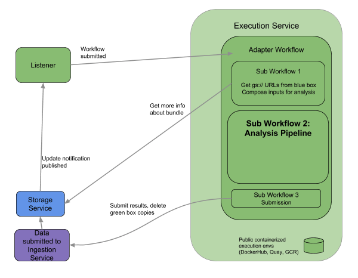

## What is Secondary Analysis?

Secondary analysis is the process by which a computational pipeline, designed to examine data from a specific assay, is used to analyze raw experimental data. In the HCA project, secondary analysis produces collections of quality metrics and features that can be used for further analysis. For example, secondary analysis of single cell RNA-Seq data results in aligned, QC’d reads, a matrix of gene expression, and a matrix of quality control metrics describing the data.   

## What is the Secondary Analysis Service?
The Secondary Analysis Service consists of analysis pipelines and execution infrastructure that move raw data through analysis, producing measurements that are ingested into the Data Storage Service for storage and download by anyone, including you! The HCA DCP stores both the submitted raw data and data resulting from secondary analysis, and each type is available for download. As new single cell technologies and analysis methods are developed and accepted by the research community, we will implement new secondary analysis pipelines and make both the pipelines and the data publically available.  

Secondary analysis pipelines are each bespoke to the characteristics of the data they process. These pipelines can attempt to address the quality of the measurements, detecting false positives or negatives, optimal processing (such as aligning, collapsing UMIs, or segmenting images into accurate features), and many other concerns. Please see the details about each of our pipelines and send us your feedback and suggestions!

The following are pipelines in development or production in the HCA DCP:

| Pipeline Name | Data Type                                   | Description                                                                                                                            | Analysis Output                                     |
|------------------|---------------------------------------------|----------------------------------------------------------------------------------------------------------------------------------------|-----------------------------------------------------|
| Smart-seq2    | Full transcript single cell transcriptomics | This pipeline currently supports the Smart-seq2 protocol as described here. Read more about the pipeline                               | Aligned BAM with tagsCounts Matrix (genes)QC Matrix |
| Optimus       | 3’ capture single cell transcriptomics      | This pipeline currently supports our first offering for 3’ scRNA-Seq, 10X V2 library prep and processing. Read more about the pipeline. | Aligned BAM with tagsCounts Matrix (genes)QC Matrix |

## Secondary Analysis Service Portability
In keeping with our goal of enabling the community to analyze single cell data using the most reliable and informative approaches currently available, and to facilitate computational development, our pipelines have been constructed to be portable to environments outside of the HCA. Using the portability service, you can determine whether a workflow you’ve developed will work in the HCA, or select non-HCA environments. Additionally, you can attach an environment to the portability system to check whether an HCA pipeline works in your own system. You can read more about portability here. 

## Data flow through the secondary analysis service

When data is submitted to the Ingestion Service (purple box in the figure above), it is validated for technical requirements (eg. data formats, data corruption) and then moved to the Data Storage Service (blue box), which triggers a notification to the Secondary Analysis Service Listener (first green box) that data is available for secondary analysis. Depending on the experimental method used to generate the data (found in the metadata of the submission), the appropriate analysis pipeline is selected for data processing. The Execution Service then applies Sub Workflow 1 to obtain the data file(s) from the original data bundle. The data in these files are analyzed using the appropriate pipeline (Sub Workflow 2), producing new files of analysis results which are submitted (Sub Workflow 3) back to the Ingestion Service as a secondary bundle, for validation and subsequent storage in the HCA.

## Access to pipeline outputs
Data bundles containing outputs are publicly available and can be accessed programmatically or through the HCA Data Browser. For information about programmatic access, view the documentation for the CLI here.  To browse the data, use the data portal. Additional analysis options are accessible from the Community Tools and Applications links in the Learn section of this website.

